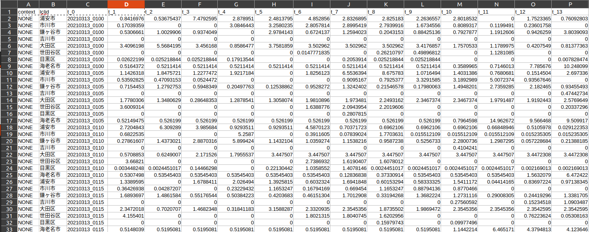
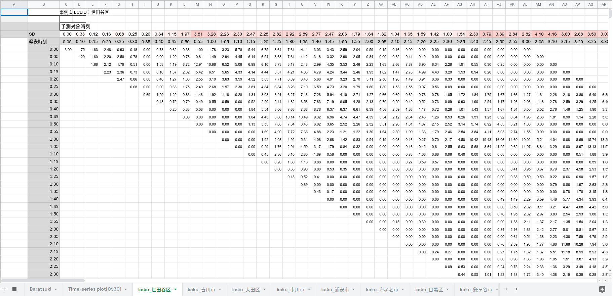
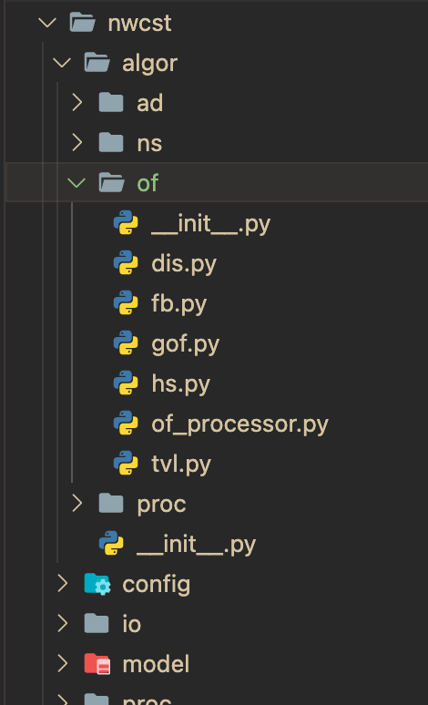

---
# pandoc wni_transfer_guideline.md -o pdf/wni_transfer_guideline.pdf --from markdown --template /home/vmodev/.local/share/pandoc/templates/eisvogel.tex --listings --pdf-engine=xelatex --toc --number-sections

papersize: a4
lang: vi-VN
# geometry:
#     - top=30mm
#     - left=20mm
#     - right=20mm
#     - heightrounded
documentclass: article
title: Bijikon server guideline
author: VMO Holdings .Jsc
date: 20-01-2021
titlepage: true
toc-own-page: true
logo: images/vmo.png
header-includes: 
      - |
        ``` {=latex}
        \let\originAlParaGraph\paragraph
        \renewcommand{\paragraph}[1]{\originAlParaGraph{#1} \hfill}
        ```
...


# WNI script

## Diagolization result script
### Requirements

Given a table of prediction in different timestamps and localtion, export an diagolized table for each lclid (location name)

The columns in the given table include:

* context
* lclid
* t_0
* t_1
* ...
* t_36



Important columns:

1. lclid: place name
2. t_1 -> t_36: accuracy

For each lclid, rearrange data as follow:



The script has been finished and can use immediately.

## Transpose accuracy result script


## Storm and map drawing script using matplotlib


# Improve accuracy of WNI nowcasting using deep learning instead of traditional machine learning method

## Applied deep learning on local optical flow

Local optical flow right now is using Hornchunk as a prediction method. Accuracy can be improve using deep learning. Implement the following method on the nowcasing code.

PWCNet


## Applied deep learning on global optical flow


## Applied deep learning on radar image prediction

# New task for Harupy-san

## Data

The data we use is 3 type of weather, which is in these date. Please apply the algorithms on all of these date, and compare them with the existing algorithms.

1. Squall line

- 2018/6/20
- 2018/6/29
- 2019/6/30
- 2019/7/19
- 2020/7/3~8

2. Typhoon
- 2018/6/15~16
- 2018/9/4
- 2018/9/30
- 2019/8/9
- 2019/9/30
- 2019/10/12

3. Scatter Rain
- 2018/07/08
- 2018/09/02
- 2018/10/18
- 2018/10/19
- 2019/07/16
- 2019/09/10
- 2020/05/11

These data could be cut to match the storm map.

## Add PWCNet and FlowNet2 on the nowcasting code

Right now, PWCNet (pwc) and FlowNet2 (fn2) are running in the docker, you can find that more in the github repository. Link of PWCNet and FlowNet are below.

1. [FLowNet2](https://github.com/NVIDIA/flownet2-pytorch)
2. [PWCNet](https://github.com/NVlabs/PWC-Net)

Customer want to merge these optical flow prediction method to the nowcasting code. We have to add new separated file for the algorithms in the following directory of the nwcst repo.

{ width=20% }

Add new file ```nwcst/algor/of/pwc.py``` and ```nwcst/algor/of/fn2.py```.

In ```nwcst/algor/of/__init.py__```, define pwc and fn2.

```
class OpticalFlow:

    model_class_map = {
        "hs": HS,
        "fb": FB,
        "dis": DIS,
        "tvl": TVL,
        "gof": GOF
    }

    @staticmethod
    def create(model,*args,**kwargs):
        return OpticalFlow.model_class_map[model](*args,**kwargs)

    @staticmethod
    def HS(*args, **kwargs):
        return HS(*args, **kwargs)

    @staticmethod
    def FB(*args, **kwargs):
        return FB(*args, **kwargs)

    @staticmethod
    def DIS(*args, **kwargs):
        return DIS(*args, **kwargs)

    @staticmethod
    def TVL(*args, **kwargs):
        return TVL(*args, **kwargs)

    @staticmethod
    def GOF(*args, **kwargs):
        return GOF(*args, **kwargs)
```

for example, in ```model_class_map``` add ```"pwc": PWC```.

Then, sefine with decorator ```@staticmethod```.

```
    @staticmethod
    def PWC(*args, **kwargs):
        return PWC(*args, **kwargs)
```

The new file has to have the structure like this.

```
import numpy as np
import optflow
import cv2
from nwcst.algor.proc import func
'''==========Config Parameters============
        fb:
            scale_image: True
            numLevels: 5
            pyrScale: 0.5
            fastPyramids: False
            winSize: 13
            numIters: 10
            polyN: 5
            polySigma: 1.5
            flags: 0
'''


class FB:
    def __init__(self, conf=None):
        self.conf = conf['fb']

    def calc(self, imgs):
        if self.conf['scale_image']:
            print("scale")
            im_scaled_0, c0_1, c0_2 = func.scaler(imgs[-2])
            im_scaled_1, c1_1, c1_2 = func.scaler(imgs[-1])
        else:
            im_scaled_0 = imgs[-2].copy()
            im_scaled_1 = imgs[-1].copy()
        im0 = im_scaled_0.astype(np.uint8)
        im1 = im_scaled_1.astype(np.uint8)

        of_instance = cv2.FarnebackOpticalFlow_create(numLevels=self.conf['numLevels'],
                                                      pyrScale=self.conf['pyrScale'],
                                                      fastPyramids=self.conf['fastPyramids'],
                                                      winSize=self.conf['winSize'],
                                                      numIters=self.conf['numIters'],
                                                      polyN=self.conf['polyN'],
                                                      polySigma=self.conf['polySigma'],
                                                      flags=self.conf['flags'])
        delta = of_instance.calc(im0, im1, None)
        u = delta[..., 0]
        v = delta[..., 1]
        return u, v
```

Where as class name = PWC or FN2 upper case.

Replace FB lowercase and uppercase as pwc and fn2 corresponding to it. 

Define fn2 and pwc algorithms in the ```calc``` function.

The goal is to compare the algorithm with the original one, and see if it improves accuracy.

**Create new branch** and push it the the repo.

